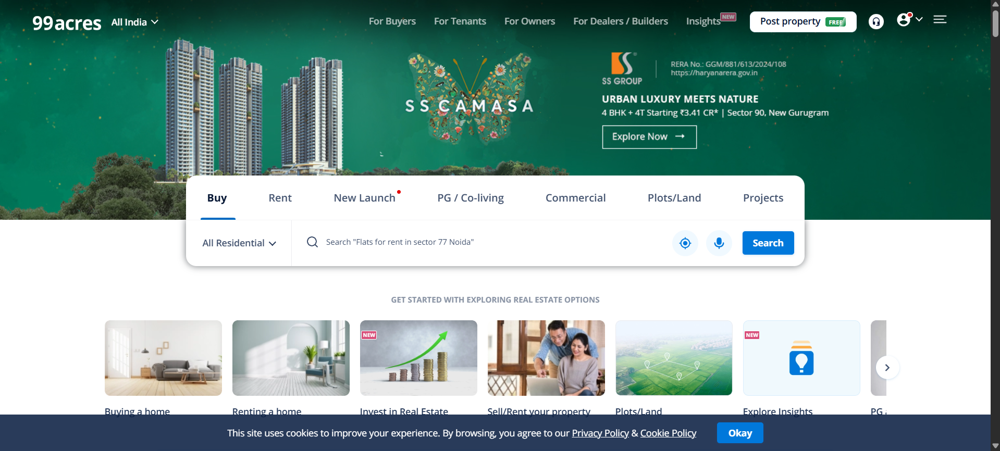

# 🏠 99Acres.com Scraper


A powerful and customizable web scraper for extracting real estate data 🏘️ from [99acres.com](https://www.99acres.com/), one of India's leading property listing websites.

## 🎥Project Demo 

# Click on the image to watch video

[](https://youtu.be/8Tu0r3jmK6I)

---

## 🚀 Features

- 🔍 Scrapes listings from 99acres.com based on location, property type, and budget
- 🧹 Cleans and structures the data for analysis
- 💾 Saves output to CSV / JSON / Database
- ⚙️ Easy to configure and extend
- 🌐 Handles pagination and dynamic loading

---

## 📦 Requirements

- Python 3.7+
- BeautifulSoup
- Requests
- Pandas
- Selenium for dynamic content

## 📦 Project Structure

```bash

📦99acres-scraper/
 ┣ 📜scraper.py          # Main script
 ┣ 📜analysis.ipynb      # Analysis file
 ┣ 📁stock_data.xlsx/    # Scraped data output
 ┗ 📜README.md

